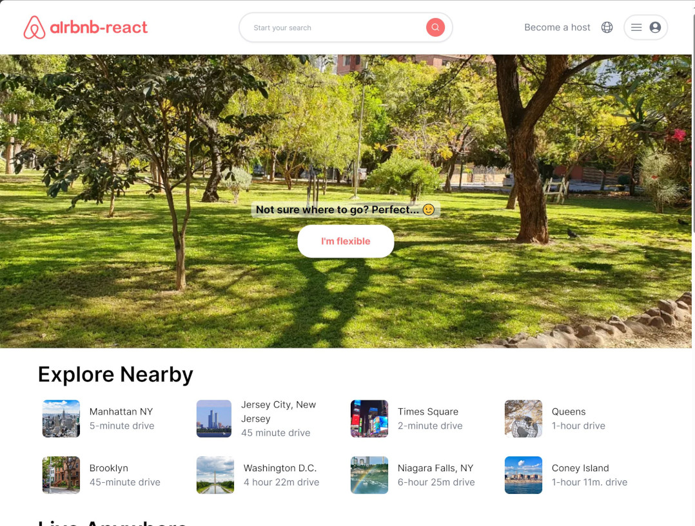

# Airbnb-React

Airbnb Clone made with Next.js + Tailwind CSS. App similar to Airbnb UI that simulates the process of searching for and listing stays.

Try it out at: <a href="https://airbnb-react-demo.vercel.app/" target="_blank">https://airbnb-react-demo.vercel.app/</a>

## Screenshots:

  

## Technologies

The following technologies, frameworks, and libraries were used:

- [React.js](https://react.dev/). The best library for Web and user interfaces.
- [Next.js 13 by Vercel](https://nextjs.org/). The React Framework for the Web, used by some of the world's largest companies, Next.js enables you to create full-stack Web applications by extending the latest React features, and integrating powerful Rust-based JavaScript tooling for the fastest builds.
- TypeScript
- [TailwindCSS](https://tailwindcss.com/), the best utility-first CSS framework.
- [Heroicons](https://github.com/tailwindlabs/heroicons)
- [Vercel](https://vercel.com), a good deployment platform for Next.js.

## Disclaimer

This is only a demo project with the intention of test and practice with the latest Next.js framework features for React. This app is not for commercial ussage.

- Airbnb-react based on logo obtained from: [DesignStudio, Public domain, via Wikimedia Commons](https://commons.wikimedia.org/wiki/File:Airbnb_Logo_B%C3%A9lo.svg).
- Other images, and thumbnails used were obtained from [Pexels](https://www.pexels.com/), the best free stock photos, royalty free images & videos shared by creators.
